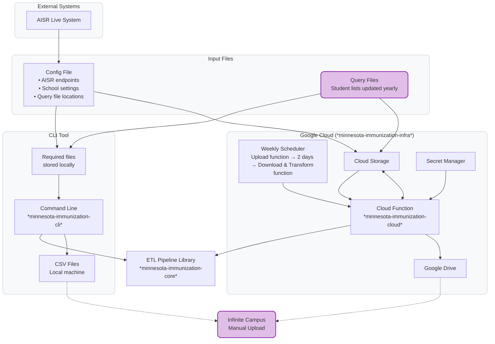

# Minnesota Immunization Records Pipeline

This system automates the processing of student immunization records from Minnesota's AISR system and generates CSV files for school administrators to upload to Infinite Campus.

## How It Works

The system performs three main steps:

1. **Upload Query Files** - Uploads your student lists (query files) to AISR system
2. **Download Results** - Downloads immunization records from AISR (2 days later)
3. **Transform Data** - Converts AISR format to Infinite Campus CSV format

These steps can be run individually via CLI or automated together via Google Cloud on a weekly schedule, with final files delivered to Google Drive.

## Architecture

The diagram below shows how the three pipeline steps map to components:
- **Step 1 (Upload)**: CLI or CloudFn uploads Query Files to AISR
- **Step 2 (Download)**: CLI or CloudFn downloads vaccination records from AISR
- **Step 3 (Transform)**: Core library processes downloaded data into Infinite Campus format



**Purple** highlights what requires your action (Query files updated yearly, CSV upload to Infinite Campus weekly)

## Getting Started

To run this system with real data, you need credentials for Minnesota's AISR system (MDH) and access to Infinite Campus for uploading the final CSV files. You can run the pipeline locally using the CLI tool (see [CLI README](minnesota-immunization-cli/README.md)) or deploy it to Google Cloud for automated weekly processing (see [Infrastructure README](minnesota-immunization-infra/README.md)). The cloud deployment is recommended for production use as it handles scheduling and file delivery automatically.

## Repository Structure

- **`minnesota-immunization-core/`** - Core ETL pipeline library for processing immunization records
- **`minnesota-immunization-cli/`** - Command-line interface to the core library
- **`minnesota-immunization-cloud/`** - GCP Cloud Function deployment of the core library
- **`minnesota-immunization-infra/`** - Terraform infrastructure code for GCP deployment
- **`minnesota-immunization-mock/`** - Mock server for end-to-end testing

## Workspace Details

Each workspace has its own README with specific setup and usage instructions:
- Core: See [`minnesota-immunization-core/README.md`](minnesota-immunization-core/README.md)
- CLI: See [`minnesota-immunization-cli/README.md`](minnesota-immunization-cli/README.md)
- Cloud: See [`minnesota-immunization-cloud/README.md`](minnesota-immunization-cloud/README.md)
- Infrastructure: See [`minnesota-immunization-infra/README.md`](minnesota-immunization-infra/README.md)

---

## Developer Setup

This section is for developers who want to contribute to or modify the codebase.

### Prerequisites

- [UV](https://docs.astral.sh/uv/) package manager (handles Python installation automatically)
    ```bash
    curl -LsSf https://astral.sh/uv/install.sh | sh
    ```

### Installation

1. **Clone the repository**
   ```bash
   git clone https://github.com/DillonOLeary/immunization-records-pipeline
   cd immunization-records-pipeline
   ```

2. **Set up development environment**
   
   Install development dependencies for the workspaces you need:
   ```bash
   # Core library
   cd minnesota-immunization-core
   uv pip install -e ".[dev]"
   
   # CLI (if working with command-line interface)
   cd ../minnesota-immunization-cli
   uv pip install -e ".[dev]"

   # Cloud (if working with the cloud function)
   cd ../minnesota-immunization-cloud
   uv pip install -e ".[dev]"
   ```

3. **Verify installation**
   ```bash
   # Run tests
   cd minnesota-immunization-core
   uv run pytest
   ```
VSCode is configured to run discovered tests automatically when you open the workspace.

### Development

#### Running Tests
```bash
# Run all tests for a package
cd minnesota-immunization-core
uv run pytest
```

#### Linting
```bash
# Check code style within a pyproject
uv run ruff .

# Auto-fix issues
uv run ruff . --fix
```

#### Mock Server

For end-to-end testing, a mock AISR server is available. Contact Dillon for the current Cloud Run endpoint.

## License

[GNU General Public License v3.0](/LICENSE)
