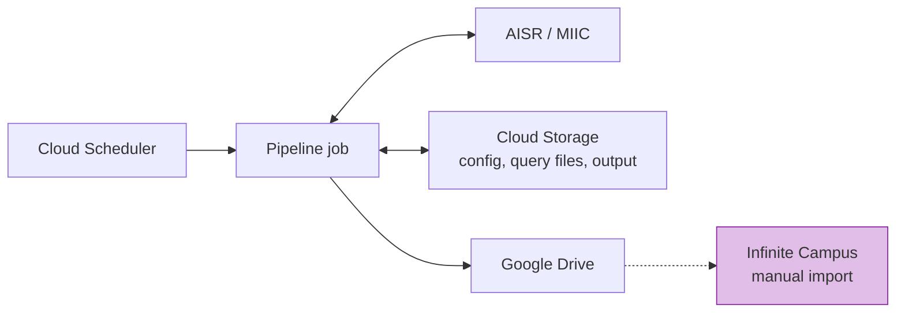

# Minnesota Immunization Records Pipeline

Automates student immunization records from Minnesota's AISR system (MIIC)
into CSV files that school staff import into Infinite Campus.

**A rewrite is in progress on this branch.** [ARCHITECTURE.md](ARCHITECTURE.md)
is the source of truth for the target design, the build phases, and current
progress. This README describes how to work with the repo as it stands.

## How it works

1. **Upload query files** - student rosters are submitted to AISR as bulk
   queries
2. **Download results** - immunization records come back a few days later
3. **Transform and diff** - AISR format becomes Infinite Campus format, and
   only records new since the last run are kept
4. **Deliver** - the diff lands in Google Drive, where staff import it into
   Infinite Campus

In production these steps run on a schedule in Google Cloud (project
`mn-immun-bd9001`), with credentials in Secret Manager and data in Cloud
Storage. The same code runs locally through the CLI.


```mermaid
graph LR
    Scheduler[Cloud Scheduler] --> Fn[Pipeline job]
    Fn <--> AISR[AISR / MIIC]
    Fn <--> GCS[Cloud Storage<br/>config, query files, output]
    Fn --> Drive[Google Drive]
    Drive -.-> IC[Infinite Campus<br/>manual import]
    style IC fill:#e1bee7,stroke:#8e24aa
```

## Developer setup

```sh
uv sync                           # installs the package, dev deps, and mock
uv run pytest                     # full test suite (spins a local mock AISR)
uv run ruff check src tests mock  # lint
uv run mock-server                # standalone fake AISR server
uv run mn-immunization --config config.json transform
```

`config.json.example` documents the config shape. Real config, rosters, and
query files never live in this repo (enforced by .gitignore); production
reads them from Cloud Storage.

## Repository structure

- `src/mn_immunization/` - the package, in vertical slices:
  - `etl/` - extract/transform/load pipeline (legacy shape, being replaced)
  - `sources/aisr/` - AISR authentication and bulk-query/download client
  - `runtime/` - CLI entrypoint and cloud handlers
- `mock/` - fake AISR server (uv workspace member, used by tests and local dev)
- `infra/` - Terraform for the GCP deployment
- `tests/` - mirrors the slices; `tests/cli` runs the real CLI in a subprocess

## License

See [LICENSE](LICENSE).
