# Minnesota Immunization Records Pipeline

This data engineering project processes student immunization records from Minnesota's AISR system and generates CSV files for school administrators to upload to Infinite Campus.

## Process Overview

The pipeline consists of three main functions:

1. **Upload Query Files** - Upload student lists (query files) to AISR system
2. **Download Results** - Download immunization records from AISR based on queries
3. **Transform Data** - Convert AISR format to Infinite Campus CSV format

These can be run individually via CLI or automated together via Google Cloud.

## Architecture

```mermaid
graph TB
    subgraph ext ["External Systems"]
        AISR[AISR Live System]
        Mock[Mock Server<br/>*minnesota-immunization-mock*<br/>Testing]
    end
    
    subgraph input ["Input Files"]
        Config[Config File<br/>• AISR/Mock endpoints<br/>• School settings<br/>• Query file locations]
        Query[Query Files<br/>Student lists updated yearly]
    end
    
    Core[ETL Pipeline Library<br/>*minnesota-immunization-core*]
    
    subgraph cli ["CLI Tool"]
        CLI[Command Line<br/>*minnesota-immunization-cli*]
        LocalConfig[Required files<br/>stored locally]
        LocalCSV[CSV Files<br/>Local machine]
    end
    
    subgraph cloud ["Google Cloud (*minnesota-immunization-infra*)"]
        CloudFn[Cloud Function<br/>*minnesota-immunization-cloud*]
        Scheduler[Weekly Scheduler<br/>Upload function → 2 days → Download & Transform function]
        GCS[Cloud Storage]
        Secrets[Secret Manager]
        Drive[Google Drive]
    end
    
    AISR --> Config
    Mock -.-> Config
    
    Config --> LocalConfig
    Config --> GCS
    Query --> LocalConfig
    Query --> GCS
    
    LocalConfig --> CLI
    CLI --> Core
    GCS --> CloudFn
    CloudFn --> Core
    
    CLI --> LocalCSV
    CloudFn --> Drive
    
    
    Scheduler --> CloudFn
    CloudFn <--> GCS
    Secrets --> CloudFn
    
    LocalCSV -.-> IC[Infinite Campus<br/>Manual Upload]
    Drive -.-> IC
    
    %% Functions/Code/Infrastructure
    style Core fill:#e3f2fd,stroke:#1976d2,stroke-width:2px,rx:10,ry:10
    style CLI fill:#e3f2fd,stroke:#1976d2,stroke-width:2px,rx:10,ry:10
    style CloudFn fill:#e3f2fd,stroke:#1976d2,stroke-width:2px,rx:10,ry:10
    style Mock fill:#e3f2fd,stroke:#1976d2,stroke-width:2px,rx:10,ry:10
    style Scheduler fill:#e3f2fd,stroke:#1976d2,stroke-width:2px,rx:10,ry:10
    style GCS fill:#e3f2fd,stroke:#1976d2,stroke-width:2px,rx:10,ry:10
    style Secrets fill:#e3f2fd,stroke:#1976d2,stroke-width:2px,rx:10,ry:10
    style Drive fill:#e3f2fd,stroke:#1976d2,stroke-width:2px,rx:10,ry:10
    style AISR fill:#e3f2fd,stroke:#1976d2,stroke-width:2px,rx:10,ry:10
    
    %% Data/Files
    style Config fill:#f1f8e9,stroke:#689f38,stroke-width:2px,rx:10,ry:10
    style LocalConfig fill:#f1f8e9,stroke:#689f38,stroke-width:2px,rx:10,ry:10
    style Query fill:#f1f8e9,stroke:#689f38,stroke-width:2px,rx:10,ry:10
    style LocalCSV fill:#f1f8e9,stroke:#689f38,stroke-width:2px,rx:10,ry:10
    
    %% Subgraph backgrounds
    style ext fill:#f8f9fa,stroke:#dee2e6,stroke-width:2px,rx:10,ry:10
    style input fill:#f8f9fa,stroke:#dee2e6,stroke-width:2px,rx:10,ry:10
    style cli fill:#f8f9fa,stroke:#dee2e6,stroke-width:2px,rx:10,ry:10
    style cloud fill:#f8f9fa,stroke:#dee2e6,stroke-width:2px,rx:10,ry:10
    
    %% External/Manual elements
    style IC fill:#e1bee7,stroke:#8e24aa,stroke-width:2px,rx:10,ry:10
```



**Color Key:**
- 🔵 **Blue**: Functions, code, and infrastructure components
- 🟢 **Green**: Data files and configuration
- 🟣 **Purple**: External systems requiring manual interaction

## Repository Structure

- **`minnesota-immunization-core/`** - Core ETL pipeline library for processing immunization records
- **`minnesota-immunization-cli/`** - Command-line interface to the core library
- **`minnesota-immunization-cloud/`** - GCP Cloud Function deployment of the core library
- **`minnesota-immunization-infra/`** - Terraform infrastructure code for GCP deployment
- **`minnesota-immunization-mock/`** - Mock server for end-to-end testing

## Prerequisites

- [UV](https://docs.astral.sh/uv/) package manager (handles Python installation automatically)
- Git

## Quick Start

1. **Clone the repository**
   ```bash
   git clone https://github.com/DillonOLeary/immunization-records-pipeline
   cd immunization-records-pipeline
   ```

2. **Set up development environment**
   
   Install development dependencies for the workspaces you need:
   ```bash
   # Core library
   cd minnesota-immunization-core
   uv pip install -e ".[dev]"
   
   # CLI (if working with command-line interface)
   cd ../minnesota-immunization-cli
   uv pip install -e ".[dev]"

   # Cloud (if working with the cloud function)
   cd ../minnesota-immunization-cloud
   uv pip install -e ".[dev]"
   ```

3. **Verify installation**
   ```bash
   # Run tests
   cd minnesota-immunization-core
   uv run pytest
   ```
VSCode is configured to run discovered tests automatically when you open the workspace.

## Development

### Running Tests
```bash
# Run all tests for a package
cd minnesota-immunization-core
uv run pytest
```

### Linting
```bash
# Check code style within a pyproject
uv run ruff .

# Auto-fix issues
uv run ruff . --fix
```

### Mock Server

For end-to-end testing, a mock AISR server is available. Contact Dillon for the current Cloud Run endpoint.

## Workspace Details

Each workspace has its own README with specific setup and usage instructions:
- Core: See `minnesota-immunization-core/README.md`
- CLI: See `minnesota-immunization-cli/README.md`
- Cloud: See `minnesota-immunization-cloud/README.md`
- Infrastructure: See `minnesota-immunization-infra/README.md`

## License

GNU General Public License v3.0 or later
