# Design Philosophy: Minnesota Immunization Infrastructure

## Vision: Brilliant Simplicity for Statewide Impact

This infrastructure is designed for **statewide deployment** across Minnesota school districts. The core principle is "brilliant simplicity" - maximum reliability and security with minimum complexity.

## Architecture Overview

```mermaid
graph TB
    A[Cloud Scheduler<br/>Monday 9am] -->|Triggers| B[Pub/Sub Topic]
    B --> C[Upload Function]
    C -->|Uploads data to| D[AISR System]
    
    E[Cloud Scheduler<br/>Wednesday 9am] -->|Triggers| F[Pub/Sub Topic]
    F --> G[Download Function]
    G -->|Downloads from| D
    G -->|Transforms & stores| H[Storage Bucket<br/>HIPAA Compliant]
    
    I[Service Account] -.->|Secure access| C
    I -.->|Secure access| G
    J[Secret Manager] -.->|AISR credentials| C
    J -.->|AISR credentials| G
    
    style H fill:#e1f5fe
    style D fill:#fff3e0
    style I fill:#f3e5f5
    style J fill:#e8f5e8
```



## Design Principles

### 1. **Statewide Scalability**

**Problem:** Each of Minnesota's 500+ school districts needs immunization processing  
**Solution:** One codebase, infinite deployments


Each district runs:
```bash
git clone minnesota-immunization-infra
cd minnesota-immunization-infra
# Change only project_id in terraform.tfvars
terraform apply
```

### 2. **Event-Driven Architecture**

**Why:** Reliability + Cost Efficiency + Zero Maintenance


**Benefits:**
- Functions only run when needed (cost: ~$2/month per district)
- Google's Pub/Sub has 99.95% uptime SLA
- Automatic retries on failure
- No servers to maintain

### 3. **Security by Design (HIPAA Compliant)**

**Student health data requires maximum protection:**


**Security Features:**
- **Encryption**: Google-managed keys (HIPAA compliant by default)
- **Access Control**: Service accounts with minimal permissions
- **Credential Management**: Secrets stored in Google Secret Manager
- **Data Lifecycle**: Automatic 3-year retention and deletion
- **Versioning**: File versioning for data integrity

### 4. **Operational Simplicity**

**Problem:** School IT staff have limited time and resources  
**Solution:** Zero-maintenance infrastructure


**Operational Benefits:**
- Fully automated weekly cycle
- Cloud monitoring and alerting
- Detailed logs for troubleshooting
- Manual override capabilities

## Technology Choices

### Why Google Cloud Functions (Gen 2)?

1. **Serverless**: No infrastructure to manage
2. **Auto-scaling**: Handles load spikes during enrollment periods
3. **Pay-per-use**: Cost-effective for periodic workloads
4. **Python 3.11**: Modern runtime with excellent library support

### Why Terraform?

1. **Infrastructure as Code**: Version controlled, peer-reviewable
2. **Reproducible**: Same infrastructure across all districts
3. **Open Source**: No vendor lock-in
4. **Community**: Large ecosystem and support

### Why Event-Driven (Pub/Sub + Scheduler)?

1. **Reliability**: Pub/Sub has enterprise-grade SLAs
2. **Decoupling**: Components can be updated independently
3. **Monitoring**: Built-in observability and alerting
4. **Retry Logic**: Automatic handling of transient failures

## Cost Analysis

### Per District Monthly Cost (Estimated)


- **Cloud Functions**: ~$1.20/month (2 executions/week, 5min each)
- **Cloud Storage**: ~$0.50/month (assuming <100MB data)
- **Pub/Sub**: ~$0.20/month (8 messages/month)
- **Secret Manager**: ~$0.10/month (2 secrets)

**Total: ~$2/month per district**

### Statewide Impact
- 500 districts × $2/month = $1,000/month statewide
- Compare to: Single proprietary solution at $50,000+/year
- **Cost savings: 83%+ vs commercial alternatives**

## Deployment Strategy

### Phase 1: Pilot Districts (2-3 districts)


### Phase 2: Regional Rollout (10-20 districts)


### Phase 3: Statewide (All districts)


## Why This Will Work Across Minnesota

### Technical Reasons
- **Standardized**: Same AISR system statewide
- **Isolated**: Each district gets separate Google Cloud project
- **Scalable**: Architecture handles 1 district or 1,000 districts
- **Maintainable**: Single codebase for all deployments

### Practical Reasons
- **Budget-Friendly**: $24/year per district vs thousands for commercial solutions
- **Open Source**: Districts can customize for their needs
- **No Vendor Lock-in**: Built on open standards
- **Community-Driven**: Districts can contribute improvements

### Success Metrics
- **Reliability**: >99% successful data transfers
- **Cost**: <$50/district/year (vs $500+ for alternatives)
- **Adoption**: >50% of districts using within 2 years
- **Contribution**: >5 districts contributing code improvements

## Future Enhancements

### Phase 1 Improvements


### Phase 2 Possibilities
- Real-time sync option
- Multi-state compatibility
- Integration with other school systems
- Machine learning for data quality

---

*This design prioritizes reliability, security, and simplicity over complexity. Every architectural decision serves the ultimate goal: ensuring Minnesota students can attend school without immunization record barriers.*